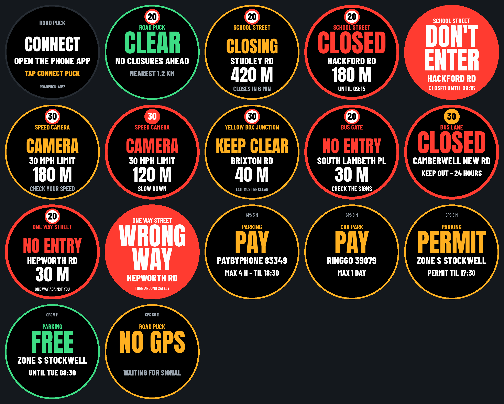

# Road Puck

A dashboard alert for London drivers. Your phone watches your GPS against a dataset of
camera-enforced road restrictions and tells you, in big bold letters, whether the street
ahead is **OPEN**, **CLOSING** or **CLOSED**. A small round puck on the dash mirrors it.

This first test area is **Lambeth**:

| Layer | What it warns about | Source |
| --- | --- | --- |
| School Streets | 43 timed closures: OPEN / CLOSING / CLOSED / DON'T ENTER | Lambeth Council |
| Bus lanes | 256 lanes: in force (CLOSED), starting soon (CLOSING), not in force (OPEN) | TfL open data |
| One-way streets | WRONG WAY when driving against the flow, NO ENTRY when heading straight into one | OpenStreetMap |
| Parking | When parked: PAY (pay bay: app, location code, max stay, until when), PERMIT (permit holders, until when) or FREE (until when); the phone offers Copy code and Open PayByPhone. Nearby RingGo car parks are offered too, with their code | Lambeth Council, PayByPhone, RingGo locator |
| No entry | 360 bus gates, no-motor-vehicle filters, pedestrian zones and timed no-entry streets: NO ENTRY / DON'T ENTER (not yet checked on the ground) | OpenStreetMap |
| Speed limit | The road's limit in a roundel on every screen; amber when you're over, flashing red when well over | OpenStreetMap |
| Cameras | Speed and red-light cameras ahead: CAMERA (red if you're over) | OpenStreetMap |
| Yellow boxes | 92 box junctions: KEEP CLEAR as you approach | TfL open data |



## What's in here

| Folder | What it is |
| --- | --- |
| `docs/` | The phone app (served by GitHub Pages). `index.html` is built from `app/app.html`; `engine.js` is the alert logic. |
| `data/lambeth/` | The datasets (open any `.geojson` on GitHub to see it on a map): School Streets, bus lanes, parking zones, pay-by-phone, restrictions, cameras, yellow boxes, term dates and the street map with speed limits. |
| `firmware/RoadPuck/` | Arduino sketch for the Waveshare ESP32-S3-Touch-AMOLED-1.75. |
| `tools/` | Scripts that rebuild the data, the fonts and the app, plus the engine tests. |

## 1. Put the phone app online (once)

1. On GitHub, open this repository's **Settings → Pages**.
2. Under *Build and deployment*, choose **Deploy from a branch**, branch `main`, folder `/docs`, then **Save**.
3. After a minute the app is live at `https://<your-username>.github.io/<repo-name>/`.
   Open that on your Android phone in **Chrome** and add it to your home screen.

iPhone: Safari can't talk to Bluetooth devices. The app still works for GPS alerts, but to
reach the puck you'd need a Web Bluetooth browser such as Bluefy.

## 2. Flash the puck

1. Arduino IDE → Boards Manager → install **esp32 by Espressif**, version **3.3.10**
   (the version Waveshare tests with).
2. Install **GFX Library for Arduino** (1.6.x). The copy in Waveshare's
   `examples/arduino/libraries` folder is fine.
3. Open `firmware/RoadPuck/RoadPuck.ino` and set the Tools menu:
   - Board: **ESP32S3 Dev Module**
   - USB CDC On Boot: **Enabled**
   - Flash Size: **16MB (128Mb)**
   - Partition Scheme: **16M Flash (3MB APP/9.9MB FATFS)**
   - PSRAM: **OPI PSRAM** (required: the screen image lives here)
4. Upload. The puck shows **CONNECT**.

On the puck, the **BOOT** button:
- short press cycles brightness (bright / medium / night)
- hold for 2 seconds for demo mode, which cycles sample screens with no phone needed

## 3. Drive test

1. Open the app on the phone and tap **START GPS**. Allow location.
2. Switch on the puck, tap **CONNECT PUCK** and pick `RoadPuck-xxxx`.
3. Keep the app open with the phone mounted. The screen stays on while GPS runs.
4. Drive past a School Street during its closure times on a school day.

Try it at home first: tap **SIMULATE**, then tap along a street on the map to "drive".
The **Time** panel lets you set any day and time.

## How the alert decides

For every closure the engine measures the distance to the closed stretch of road, then:

| Puck shows | When |
| --- | --- |
| **DON'T ENTER** (flashing red) | You're within 35 m of a closed stretch (plus up to 40 m for GPS error). |
| **CLOSED** | A closure is inside your look-ahead zone, in front of you, and closed now or by the time you'd reach it. |
| **CLOSING** | A closure ahead starts within 30 minutes. |
| **OPEN** | A closure ahead is open right now (between times, weekend or school holiday). |
| **CLEAR** | Nothing in the look-ahead zone. |
| **WRONG WAY** (flashing red) | Two GPS readings in a row on a one-way street, travelling against its direction. |
| **NO ENTRY** | The street 25-45 m straight ahead is one-way against you (and isn't the road you're on). |
| **BUS LANE: CLOSED / CLOSING / OPEN** | You're on a road with a bus lane, travelling its way, and it is in force / starts within 15 min / not in force. GPS can't tell lanes apart, so this tells you the rule, not that you're in the lane. |
| **PAY / PERMIT / FREE** | Stopped for 15 seconds. PAY: a pay-by-phone bay within about 45 m is charging now (shows the app and location code, max stay, until when). PERMIT: the zone is controlled and there's no pay bay on this street (the phone names the nearest one). FREE: controls are off, and until when. |
| **NO ENTRY** (bus gate, no motor vehicles, pedestrian zone, timed) | The restricted street is 30-80 m straight ahead, lined up with your direction, and in force. |
| **DON'T ENTER** (restricted street) | Two GPS readings in a row on a restricted street while it's in force. |
| **CAMERA** | A camera within 250-400 m ahead (further when faster), within 25 m of your line of travel. Red if you're over the limit. |
| **KEEP CLEAR** | A yellow box junction within 70 m ahead, or you're in it. |
| **Speed badge** | Limit of the road you're on. Amber above the limit, flashing red at 10% + 2 mph over (22 in a 20, 35 in a 30). |
| **NO GPS** | GPS accuracy worse than 100 m, or no fix for 15 seconds. |

When several things apply, the puck shows the most urgent:
DON'T ENTER / WRONG WAY, then CAMERA, then School Street CLOSED, then NO ENTRY ahead, then KEEP CLEAR,
then a bus lane you're driving beside, then anything CLOSING, then parking, then OPEN / CLEAR.
A bus lane that starts just ahead of you counts as CLOSED ahead.

- **Look-ahead zone:** 250 m when slow, growing with speed up to 600 m, plus GPS error (capped at 50 m).
- **"In front of you":** within 75° of your direction of travel. When you're stopped there's no direction, so every nearby closure counts; the engine errs on the side of warning.
- **Arrival time:** the engine assumes at least 3 m/s, which is cautious for London traffic.
- **Steady screen:** a stronger warning is held for 4 seconds so the screen doesn't flicker.

Run `node tools/test_engine.js` to check the rules against real Lambeth positions.

## The data, and its limits

- **Closure times** come from Lambeth Council's
  [School Streets times and locations page](https://www.lambeth.gov.uk/streets-roads-transport/school-streets/school-streets-times-locations).
  Restrictions apply Monday to Friday in term time, including INSET days.
- **Term dates** use Lambeth's standard
  [2026-27 dates](https://www.lambeth.gov.uk/schools-education/school-term-holiday-dates/school-term-dates-2026-2027).
  Academies and faith schools can differ by a few days.
- **Where each closure is:** the stretch of the named road within 150 m of the point
  nearest the school, using OpenStreetMap. Real closures can be longer or shorter.
  Four are flagged `"placement": "check"` because the school sits well away from the named road.
- **Nothing has been checked on the ground yet.** Every feature has
  `"verified_on_ground": false`. After a drive past, fix the line in
  `data/lambeth/school_streets.geojson` (geojson.io is handy for editing), set it to `true`,
  and run `python3 tools/build_dataset.py`.
- **Bus lanes** come from [TfL's Bus Lanes open data](https://gis-tfl.opendata.arcgis.com/datasets/TfL::bus-lanes-1/about):
  hours for weekdays, Saturday and Sunday, direction of travel and permitted vehicles, on borough and TfL roads.
  The direction field is used, not the line's drawing order (43 of 260 lines are drawn backwards).
- **Parking zones** come from Lambeth's CPZ timing zones layer, with boundaries simplified to about 4 m.
  During controlled hours single yellow lines mean no waiting and bays need a permit or pay-by-phone.
  The app doesn't know about double yellows, red routes or individual bay signs yet: always read the sign.
  **Pay-by-phone** locations (510) come from Lambeth's ticket machine layer (council data dated January 2024), each with
  its own charging hours, maximum stay and hourly rate code (e.g. `3ph` = £3 an hour). Prices change: the app shows the real price.
  Lambeth's street bays use **PayByPhone**; `data/lambeth/parking_apps.json` lists each app, how to open it, and which
  one a borough uses for street bays (`on_street`), so other boroughs (RingGo in Westminster, Camden, Croydon and Merton)
  just need their own file. Neither app has a public link that opens it with the location filled in, so the phone offers
  **Copy code** then **Open PayByPhone** / **Open RingGo** (RingGo opens its Play Store or App Store page: tap Open).
  Lambeth's [parking bays page](https://www.lambeth.gov.uk/parking/parking-restrictions/where-you-can-park/parking-bays)
  also lists paying by phone call (020 7005 0055) and cash at PayPoint shops.
- **RingGo car parks** (8) come from the [RingGo parking locator](https://myringgo.co.uk/parkinglocator), checked
  29 Sep 2026 and kept by hand in `data/lambeth/ringgo_car_parks.json`. In Lambeth RingGo is used by private,
  off-street car parks (ParkBee, APCOA, the National Theatre, Sainsbury's Streatham Common), not council street bays.
  The list came from name searches (the locator's area search is behind a bot check), so it may miss some: add a site
  to that file and rebuild. When parked, a nearby RingGo car park is offered **alongside** the street rule, never
  instead of it, so a car on the street outside isn't told to pay the car park. Only where there's no street rule on
  the map does the car park become the main answer (puck: `CAR PARK` / `PAY` / `RINGGO 39079`).
- **No-entry restrictions** come from OpenStreetMap and are **not yet checked on the ground**: alerts say
  "CHECK THE SIGNS". After you've seen one, add it to `data/lambeth/restriction_checks.json` by its OSM way number
  (shown in the app's Data tab), e.g. `"123456789": {"verified": true, "note": "sign seen 1 Oct"}`, or
  `"verified": false` to switch a wrong one off, then run `python3 tools/build_dataset.py`.
  Timed restrictions that sit on a council School Street are dropped in favour of the council's times.
- **Speed limits** are recorded for 92% of Lambeth's streets in OpenStreetMap (mostly 20 mph). Unknown limits show no badge.
- **Cameras**: only the 23 mapped in OpenStreetMap so far. TfL says London has over 800 fixed speed and red-light
  cameras, so expect gaps; a proper camera list is the next data job.
- **Yellow boxes** come from TfL's yellow box junction layer (TfL roads and some borough roads).
- **One-way streets** come from the OpenStreetMap street map. Roundabouts and contraflow cycle lanes aren't treated specially yet.
- Street map © OpenStreetMap contributors, available under the
  [Open Database License](https://www.openstreetmap.org/copyright).

Road signs always take priority over the app.

## Rebuilding

```
python3 tools/build_dataset.py   # dataset -> docs/data
python3 tools/build_app.py       # app/app.html -> docs/index.html
python3 tools/make_fonts.py      # TTF -> firmware/RoadPuck/fonts.h
python3 tools/puck_preview.py    # docs/puck-screens.png
node tools/test_engine.js        # 50 alert rule checks on real Lambeth data
```

## Next

- Bus gates and LTN camera filters (Lambeth publishes Digital Traffic Regulation Orders; the
  national D-TRO service is free to register for).
- TfL red route stopping rules (4,530 in the area, published by TfL with times) for the parking screen.
- A fuller camera list, and average-speed camera zones.
- Yellow lines and individual parking bays (in the D-TRO data).
- More boroughs.

Fonts: Anton and Barlow Condensed, SIL Open Font License (see `firmware/RoadPuck/FONT-LICENSE-*.txt`).
